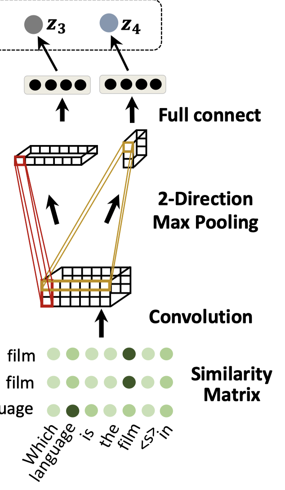
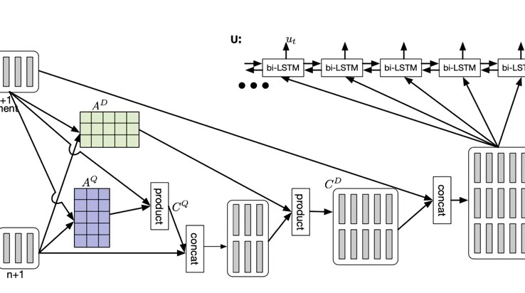
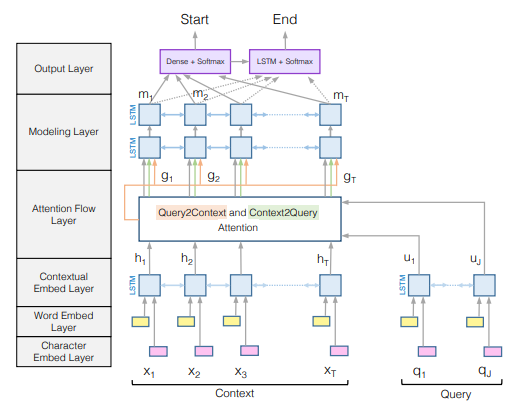

### 互联网数据挖掘大作业报告

#### 数据预处理部分

​	我们对训练数据进行了简单的统计，发现训练集中总共有264415个三元组，其中13580个是正例，250836个是负例，正例和负例比例接近1:18。同时，一个问题可能对应0～10个正确答案和0～30个错误答案。

​	为了解决数据比例严重不均衡的情况，我们使用上采样和下采样相结合的方式。我们训练时只采样正例$N_S$倍的负例，剩余负例丢弃。具体细节说明如下：我们构建一个正例池和一个负例池，每次从正例中采样一个正例的时候，从负例池中随机采样$N_S$个负例返回。

​	我们使考虑MarginLoss：$Loss = \sum \max({score}_{negative} - {score}_{positive}+margin, 0)$。其中score代表模型给问题、文本对(Question, Answer)的打分，代表其匹配程度。这里需要对正例进行上采样，保证正负比是1:1。另外在计算MarginLoss的时候，我们考虑`self-adversarial negative sampling`的方式，其本质上是我们按照如下分布来进行负采样：$P\left(q_{j}^{\prime}, a_{j}^{\prime} |\left\{\left(q_{i}, a_{i}\right)\right\}\right)=\frac{\exp \alpha f\left(\mathbf{q}_{j}^{\prime}, \mathbf{a}_{j}^{\prime}\right)}{\sum_{i} \exp \alpha f\left(\mathbf{q}_{i}^{\prime}, \mathbf{a}_{i}^{\prime}\right)}$ ，即按照更高的可能性去采样更加难学的负例。$\alpha$为超参数，当其为0是意味着等概率采样，具体代码实现时，$Loss$函数如下：$Loss = \sum P(negative) \max({score}_{negative} - {score}_{positive}+margin, 0)$  

​	关于预训练部分，我们引用了以百度百科作为文库、使用skip-gram预训练好的[中文词向量集合]((https://github.com/Embedding/Chinese-Word-Vectors))，[百度网盘地址](https://pan.baidu.com/s/1Gndr0fReIq_oJ3R34CxlPg)在这里。这里词向量解压之后得到一个文本文件，将其命名为baidubaike放置于`data`目录下。该文件的格式是`word num1 ... num300`。我们首先将其中所有的词汇提取出来的到一个`pretrained_word.txt`文件放置于`data`目录下，以这个文件作为自定义词典，使用jieba对问题和文本进行分词。分词后总共得到301841个词汇，其中编号0、1、2、3、4、5、6、7分别和问题和文本的`[PAD], [START], [END], [UNKNOWN]`字符对应，剩下的词汇对应各个具体的词汇。这样就可以把问题和文本都转化为一个编号组成的序列，可以作为embedding层的输入。

#### 模型部分

##### RNN

​	这里使用GRU模型作为baseline。使用一层GRU分别对代表问题的词向量序列和代表文本的词向量序列进行编码，将编码得到的新的词向量序列通过最大池化之后得到问题向量和文本向量。计算他们的余弦相似度即可得到问题和文本的相似度。

​	值得一提的是，我们并不希望GRU训练的时候RNN会把padding部分也进行编码，只希望它考虑前面有效的单词。这里我们使用了pytorch的 **pack_padded_sequence**函数，它保证padding不会真正进入到 GRU 中影响效果，但是需要我们事先把 input_seqs 先按长度从大到小排列一下，然后把排序后每个序列的真正长度 input_lengths 传进来，然后包装好放进 GRU 里， GRU 运行完了再用 **pad_packed_sequence** 这个函数解包一下。与此相比，tensorflow提供了dynamic_rnn函数，显得更加方便。

##### CNN

​	我们从字面思考本问答问题，可以将其视为一个文本匹配任务。我们发现如果文本和问句中具有相同或者表达差不多意思的词，那个该文本为该问句的可能性会增加。RNN可以捕捉句子语义层度的信息，但是无法捕捉字面层度的信息，因为词汇在经过不同GRU单元的编码之后会丢失基础信息而带上上下文信息。为此，我们引入CNN来编码相关信息。

​	首先，我们构造一个相似度矩阵(similarity matrix)，其第$i$行第$j$列代表着问句中第$i$个词和文本中第$j$个词的相似度，可以通过如下公式计算：$M_{i j}=u_{i} \otimes v_{j}$。$u_i$和$v_j$分别代表问句中第$i$个词的词向量和文本中第$j$个词的词向量，$\otimes$代表相似度计算，这里我们采用余弦相似度。

​	然后，我们将这个矩阵通过一个卷积层和一个最大池化层。通过最大池化层时，我们考虑两个方向的最大池化，分别对应着问题层面的最大池化和文本层面的最大池化，即对于问题中的每个词，我们找到文本句子中和它最匹配的那个词；以及对于文本中的每个词，找到句子中和它最匹配的那个词。最后将两个向量分别通过一个全连接层即可得到两个值。具体公式如下：
$$
\begin{array}{l}{
g_{i, j}^{k}=\sigma\left(\sum_{s=0}^{r_{k}-1} \sum_{t=0}^{r_{k}-1} w_{s, t}^{k} \cdot M_{i+s, j+t}+b^{k}\right) \\
y_{i}^{(1, k)}=\max _{0 \leq a x} g_{i, t}^{k}} \\ 
{y_{j}^{(2, k)}=\max _{0 \leq t<d_{2}} g_{t, j}^{k} \\
z_{1}=W_{2} \sigma\left(W_{1}\left[y^{(1,0)} ; y^{(1, K)}\right]+b_{1}\right)+b_{2}} \\ 
{z_{2}=W_{2} \sigma\left(W_{1}\left[y^{(2,0)} ; y^{(2, K)}\right]+b_{1}\right)+b_{2}}\end{array}
$$
其中$d_1$和$d_2$分别代表着相似度矩阵的长和宽。最后可以用如下公式计算出最终相似度：
$$
S\left(P, r^{k}\right)=\operatorname{Sigmoid}\left(W^{T}\left[z_{1} ; z_{2} ; z_{3}\right]+b\right)
$$
$z_3$是通过RNN计算出的相似度。

##### Co-attention RNN

模型来源于**Salesforce Research**组发表在**ICLR 2017**的***Dynamic Coattention Networks for Question Answer***，原来的问题是对于一个文档和一个问题，给出答案在文档中的位置区间，因此根据我们的问题背景对模型做了一些调整。

朴素的RNN模型直接通过**LSTM**或者**GRU**网络将问题和文档进行encode，基于encode得到的embedding计算相似度和匹配度。而**co-attention（协同注意力）**的思想则模拟了人类进行阅读理解的策略：带着问题去阅读。我们通常会首先粗糙地通读文章，理解文章大意，然后阅读题目，再在文本中根据题目有目的地阅读去寻找答案。协同注意力模型首先通过对文档和问题的初始处理理解问题，再通过处理后的问题信息结合文档对文档产生相应权重，将加权后的文档信息和初始文档信息结合起来，作为“带着问题去阅读”的对象。相比较朴素的RNN模型，协同注意力模型不是利用相似度矩阵直接输出分数，而是利用相似度矩阵在文档和问题的信息融合了对方的信息，并且最终通过融合后的文档信息输出结果，这样的处理方法可以更多地保留了文档自身的信息。

整个模型的pipeline如下：

- 通过和上述RNN模型中相同的pack-pad方法将处理后的文本序列通过LSTM网络，对语句结束处加语义标志，得到初始的问题和文档embedding：$Q\in R^{l \times (n+1)}$和 $D \in R^{l \times (m+1)}$，并且通过引入非线性变化$Q = tanh (W^{Q}Q + b^{Q})$ 包容问题和文档编码空间上的差异。
- 计算问题和文档间的相似程度 $L = D^{T}Q \in R^{(m+1) \times (n+1) }$，按列归一化得到供问题使用的attention $A^{Q} = softmax(L) \in R^{(m+1) \times (n+1) }$, 按行归一化得对应文档的 $A^{D} = softmax(L^{T}) \in R^{(n+1) \times (m+1)}$.
- 计算来自文档的信息总结 $C^{Q} = DA^{Q} \in R^{l \times (n+1)}$，并且生成包含问题初始信息和问题与文档交互信息的综合信息，即“先粗糙地看一遍文章后的问题信息” $Q^{D} = [Q; C^{Q}]$，根据问题信息，“带着问题去看文章”，得到文档信息 $C^{D} = Q^{D}A^{D} \in R^{2l \times (m+1)}$。
- 对于加入协同注意力后的文档信息$C^{D}$，通过和第一步中相同的pack-pad方法输入到bi-LSTM网络，得到结合有问题信息的文档embedding，因为经过填充后，最后的输出都是0值，所以将LSTM网络的输出通过一个max pooling层，输出最后的有效信息，通过一个线性层处理得到该文档属于正类的概率。另外一种可能的处理是直接拿到最后一个词的ouput作为整个文档的信息。

##### BIDAF

模型来自于ICLR2017的文章Bi-directional Attention Flow For Machine Comprehension，这篇文章解决的是文档QA的问题，该文章提出了一个4阶段的pipeline解决这个问题：

* 第一个阶段，问题和文档分开处理，相互之间不存在信息交流，对于问题和文档，首先通过字符嵌入、词嵌入，而后，将这两个嵌入的向量通过LSTM整合到一起，形成完整的上下文信息嵌入（contextual embed），分别为$U\in R^{J*2d}$和$H\in R^{T*2d}$。
* 第二个阶段，信息融合。问题和文档的上下文信息嵌入通过一个Attention的结构，使得文档中的信息中包含问题的信息，问题的信息中也融入文档的信息，两者可以互相表达。主要通过
  * 计算衡量文档中的每个词向量和问题中的每个词向量之间的相似度矩阵$S\in R^T * R^J$(T为文档词数，J为问题词数)。对于文档中的每个词向量$h$和问题中的每个词向量$u$，其相似度为$\alpha(h,u) = w^T[h;u;h*u]$，其中$*$为逐元素相乘。
  * 计算context-to-query attention（C2Q）。根据相似度矩阵S，针对文档中的每个词t，计算所有问题中的词与它的相似比例，即计算$a_t = softmax(S_{t:}) \in R^J$，而后就可以使用问题中的词向量表示这个词，$\hat U_{:t} = \sum_ja_{tj}U_{:j}$。针对文档中的每个词都执行该操作得到矩阵$\hat U$。
  * 计算Query-to-context attention（Q2C）。对于相似度矩阵，每个文档中的词取出与它最相似的问题中的词对应的相似度，得到一个相似度向量，对其进行softmax操作，即$b = softmax(max_{col}(S))\in R^T$。而后依照相似程度b重构文档，即$\hat h = \sum_tb_tH_{:t} $，并将其拷贝扩展为一个矩阵，$\hat H \in R^{2d*T}$。
  * 最后通过某种向量操作将其整合到一起，$G_{:t} = \beta (H_{:t},\hat U_{:t},\hat H_{:t}) \in R^{d_G}(G \in R^{T * d_G})$。
* 第三个阶段，对于整合两者信息的矩阵G进行序列信息的提取，将其再次通过两个双向LSTM层，得到$M\in R^{T*2d}$。
* 第四个阶段，最后整合得到的G和M通过输出层得到对应的结果，文档QA的问题和我们的要求还有一定的差别，这里主要阐述一下我们的做法，首先，将M和G连接到一起，得到$K\in R^{T*(2d + d_G)}$；通过最大池化（也可以通过平均池化）处理将序列信息合并，将K池化得$P \in R^{2d+d_G}$，而后通过一个全连接线性层并激活得到文档中存在问题答案的概率。

对于project中的中文文档，我们对BIDAF模型进行了一定的改动，在嵌入操作时，仅仅进行了词嵌入和上下文语义信息嵌入，并没有进行字符层次的嵌入操作。除此之外，与BIDAF模型基本一致。

##### Transformer

本模型由李墨馨使用Tensorflow实现，使用的预处理体系和模型体系和上面三个不一样，代码在transformer.zip中给出。

**预处理部分**

为了解决数据比例严重不均衡的情况，对训练集进行采样，将正例/负例的比例设为1:1，一共27160条训练数据。为了保证验证集和测试集分布的相似，不对验证集进行采样，保留39999条验证数据，在训练的时候保存valid loss最低的点。

为了加快训练速度，对过长的句子进行裁剪，最大的长度设为50。具体方法是，首先用jieba对所有中文句子进行全模式分词，然后对长度大于50的句子随机采样其中的50个词。采用全模式分词和随机采样删去词汇，可以尽量避免删去句子的关键信息。

**模型部分**
这次作业的问题可以看成是一个query response matching的问题。Google 2016年在Attention is all you need中提出的Transformer模型。在很多任务上表现出了很好的效果。Transformer整体上是一个不采用RNN的Encoder-Decoder模型。相比于RNN，Transformer可以并行优化。其中的Self-Attention机制可以捕捉到query和response之间词汇的相似信息。

我们尝试了两个基于Transformer的query response matching的模型，参考了两篇文章。一个是发表在ACL 2019的Multi-turn response selection for chatbots with deep attention matching network；另一个是IJCAI 2020的A Document-grounded Matching Network for Response Selection in Retrieval-based Chatbots。我们没有使用Transformer的Multi-Head Attention，只用了Single-Head。在实验的时候，我们发现加入Positional Encoding之后效果不太好，就没有加入position的信息。

首先把 query 和 answer 中的词转化成word embedding，用$q$和$a$表示。

第一个模型中采用了四个Transformer encoder。第一个Transformer encoder按常规方法对$q$进行encode，第二个按常规方法对$a$进行encode，第三个Transformer encoder的$(query, key, value)$分别输入$(q,a,a)$，第四个Transformer encoder输入是$(a, q, q)$。
将四个Transformer Encoder的结果进行拼接，max pooling和softmax得到0/1分类的概率。其中max pooling是对不同的encode step 提取对query中每个词，answer中attention最大的地方。
使用categorical crossentropy作为loss function，learning rate为1e-6，Transformer Encoder一共进行了5步， batch size为128。

第二个模型参考了第二篇文章中的Cross Attention Match的想法。首先用两个Transformer encoder 对$q$和$a$分别进行encode，得到一系列hidden state，$q_{enc}$和$a_{enc}$。然后对$q_{enc}$和$a_{enc}$进行Cross Attention。
$$
\begin{align}
qa_{enc_i} = \text{Encoder($q_{enc_i}$, $a_{enc_i}$, $a_{enc_i}$)}  \\
aq_{enc_i} = \text{Encoder($a_{enc_i}$, $q_{enc_i}$, $q_{enc_i}$)}
\end{align}
$$
最后把所有encoder的输出进行拼接，max pooling和softmax得到0/1分类的概率。
我们把encode的step数目略微调大了，调成了8，并稍微降低了参数数目，结果发现效果和第一个模型差别不大。

一个可能的解释是，对于这个任务而言，主要是依靠query answer之间词汇的相似性，第一个模型直接对q和a中的词汇进行self-attention，而通过两层encoder提取的更高维的语义信息没有特别重要。
这两个模型的结果都不太好，可能是模型和参数不合适的原因，在训练中表现的不是很稳定，也可能应该更换loss function。

#### 实验结果

| model                      | Recall | Precision | F1     | MAP    | MRR    |
| -------------------------- | ------ | --------- | ------ | ------ | ------ |
| RNN                        | 0.5896 | 0.4474    | 0.5088 | 0.7756 | 0.7749 |
| Coattention                | 0.7165 | 0.6913    | 0.7037 | 0.9588 | 0.9590 |
| BiDAF                      | 0.7264 | 0.3826    | 0.5012 | 0.7569 | 0.7600 |
| Transformer                | 0.5107 | 0.0701    | 0.1233 | 0.2796 | 0.2807 |
| Transformer+CrossAttention | 0.5032 | 0.0712    | 0.1248 | 0.2773 | 0.2794 |

这里值得说明的是，由于条件所限，所有模型均仅进行了简单的调参，由于时间原因未来得及给CNNRNN进行调参。最终选择了Coattention给测试机进行打分。

值得说明的是，

- RNN模型虽然简单，但是其也能取得比较不错的效果，通过Coattention和RNN的对比注意力机制则可以比较明显的增加模型的表现力。
- Transformer的参数是最难调的，未经过调参的Transformer很难有优异的表现，但这不意味着Transformer这个模型本身的能力不够强，如果给我们足够的资源，我们会考虑使用BERT搭配简单全连接层，以足够大的文库进行训练，我们相信这个模型绝对会取得最好的结果。
- MAP和MRR由我们自己实现了，代码在model.py部分149～164行，方便在训练过程中看MAP和MRR。

#### 参考文献

> Qu, Yingqi, et al. "Question answering over freebase via attentive RNN with similarity matrix based CNN." *arXiv preprint arXiv:1804.03317* 38 (2018). 
>
> Xiong, Caiming, Victor Zhong, and Richard Socher. "Dynamic coattention networks for question answering." *arXiv preprint arXiv:1611.01604* (2016).
>
> Seo, Minjoon, et al. "Bidirectional attention flow for machine comprehension." *arXiv preprint arXiv:1611.01603* (2016).
>
> Vaswani, Ashish, et al. "Attention is all you need." *Advances in neural information processing systems*. 2017.
>
> Zhou, Xiangyang, et al. "Multi-turn response selection for chatbots with deep attention matching network." *Proceedings of the 56th Annual Meeting of the Association for Computational Linguistics (Volume 1: Long Papers)*. 2018.
>
> Zhao, Xueliang, et al. "A Document-grounded Matching Network for Response Selection in Retrieval-based Chatbots." *arXiv preprint arXiv:1906.04362* (2019).

